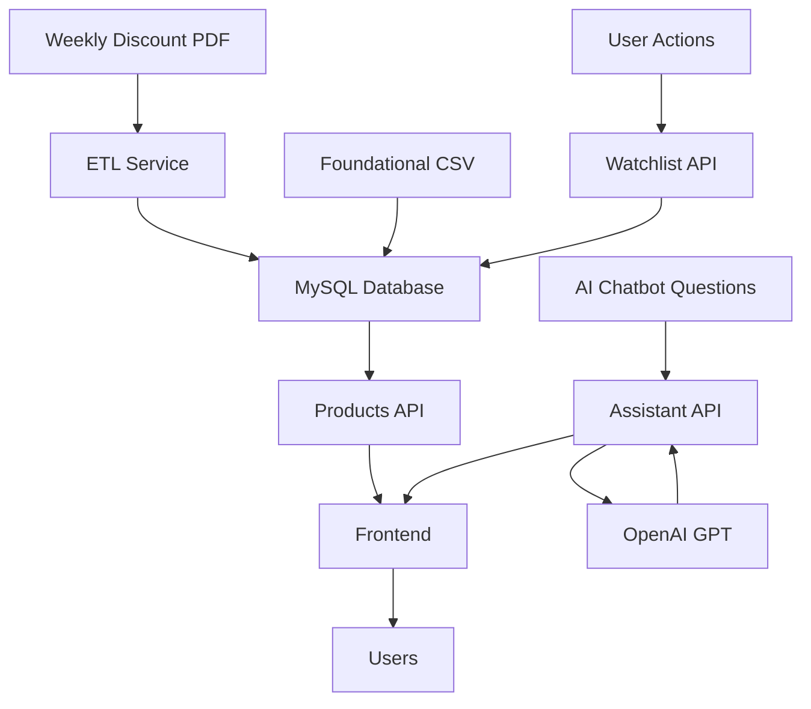

# UrSaviour Project - Comprehensive Documentation

## 🏗️ Project Structure Overview

```
UrSaviour-Project/
├── 📁 backend/              # Backend**Data Flow Description:**
1. `foundational_dataset_v1.csv` → Basic product data (raw data)
2. `no.27week_special.pdf` → Weekly discount flyer (simulation)
3. ETL process → PDF parsing → `no.27week_special.csv` → MySQL update

---

### 📁 `/scripts` - Utility Scripts
Data processing and automation tools

```
scripts/
├── 🔄 process_etl.py             # ETL process executor (PDF → DB)
└── 📑 generate_pdf_pamphlet.py   # Weekly discount flyer PDF generator
```

**Script Roles:**
- `process_etl.py`: Parse weekly uploaded discount PDFs and update database
- `generate_pdf_pamphlet.py`: Generate fake discount flyer PDFs for marketing team useI)
├── 📁 frontend/             # Frontend web application
├── 📁 data/                 # Datasets and sample files
├── 📁 scripts/              # Utility scripts
├── 📁 docs/                 # Project documentation
├── 📁 deployment/           # 🆕 AWS/EC2 deployment configs
├── 📁 debug/                # Development/debugging tools
├── 🐳 docker-compose.yml   # Container orchestration (development)
├── 🐳 docker-compose.prod.yml # 🆕 Production deployment
├── 📝 .env                  # Environment variables
├── 📝 .env.example          # Environment template
├── 📝 .env.production       # 🆕 Production environment template
├── 🗄️ schema_dump.txt      # Database schema
└── 📄 README.md            # Main project documentation
```

---

## 🗂️ Detailed Directory and File Description

### 📁 `/backend` - Backend API Server
FastAPI-based RESTful API server and business logic

#### 📂 `/backend/app/` - Main Application
```
app/
├── 🚀 main.py                    # FastAPI app entry point, CORS configuration
├── 📂 api/v1/                    # API v1 router
│   ├── router.py                 # Main router configuration
│   └── endpoints/                # API endpoints
│       ├── admin.py              # Admin functions (ETL execution, log viewing)
│       ├── assistant.py          # AI chatbot API (OpenAI integration)
│       ├── auth.py               # User authentication (login/registration)
│       ├── products.py           # Product viewing and search
│       ├── user.py               # User profile management
│       └── watchlist.py          # Watchlist management
├── 📂 core/                      # Core configuration
│   └── config.py                 # App settings, environment variable management
├── 📂 db/                        # Database related
│   ├── session.py                # DB session management
│   ├── crud/                     # CRUD operations
│   │   └── crud_base.py          # Base CRUD class
│   └── models/                   # SQLAlchemy models
│       ├── base.py               # Base model class
│       └── user.py               # User model
├── 📂 schemas/                   # Pydantic schemas
│   └── user.py                   # User validation schema
└── 📂 services/                  # Business logic services
    ├── __init__.py               # Service package initialization
    ├── auth.py                   # Authentication service (JWT, password hashing)
    ├── etl_service.py            # ETL process (PDF parsing, data transformation)
    ├── notification_service.py   # Email/push notification service
    └── pdf_service.py            # PDF processing and parsing
```

#### �️ `/backend/db/migrations/` - Alembic Database Migrations
```
migrations/
├── 📄 env.py                     # Alembic environment configuration
├── 📖 README                     # Migration guide
├── 📄 script.py.mako             # Migration script template
└── 📂 versions/                  # Migration versions
    └── 20251007_add_jobnumber.py # Job Number column addition migration
```

#### ⚙️ `/backend` Root Files
- **🐳 Dockerfile**: Backend container image build configuration
- **📋 requirements.txt**: Python dependency package list
- **⚗️ alembic.ini**: Database migration configuration
- **🗃️ init_db.py**: Initial database setup script
```
migrations/
├── env.py                        # Alembic environment configuration
├── script.py.mako               # Migration template
├── README                       # Migration guide
├── README_JOBNUMBER.md          # Job Number field addition documentation
└── versions/                    # Migration versions
    └── 20251007_add_jobnumber.py # Job Number field addition migration
```

#### 🐳 Backend deployment files
- `Dockerfile` - Backend container image build
- `alembic.ini` - Database migration configuration
- `requirements.txt` - Python dependency packages
- `init_db.py` - Database initialization script

---

---

### 📁 `/frontend` - Frontend Web Application
Vanilla JavaScript-based responsive web interface

#### 📂 `/frontend/src/` - Main Source Files
```
src/
├── 🏠 index.html                 # Main homepage
├── � login.html                 # User login page
├── 📝 register.html              # User registration page
├── �‍💼 adminlogin.html           # Admin login page
├── � products.html              # Product list and search page
├── ⭐ watchlist.html             # Watchlist management page
├── � Chat-page.html             # AI chatbot conversation page
├── 🔧 debug.html                 # Debugging and test page
├── 📂 components/                # Reusable components
│   ├── header.html               # Common header component
│   ├── footer.html               # Common footer component
│   ├── chat.html                 # Chatbot UI component
│   └── test.html                 # Test component
├── 📂 css/                       # Stylesheets
│   ├── styles.css                # Main styles (responsive design)
│   └── auth.css                  # Authentication page specific styles
├── 📂 images/                    # Images and icons
│   ├── logo.png                  # UrSaviour logo
│   ├── hero.png                  # Hero section image
│   ├── icon-ai.png               # AI feature icon
│   ├── icon-guide.png            # Guide icon
│   └── icon-price.png            # Price comparison icon
└── 📂 js/                        # JavaScript files
    ├── include.js                # Component dynamic loading
    ├── chat-toggle.js            # Chatbot toggle functionality
    ├── product_page.js           # Product page logic
    └── watchlist.js              # Watchlist management logic
```

#### 🐳 Frontend deployment files
- `default.conf` - Nginx configuration (for container deployment)

---

### 📁 `/data` - Datasets and samples
Actual data files used in the project

```
data/
├── 📊 foundational_dataset_v1.csv    # Basic product dataset (10K+ products)
├── 📄 no.27week_special.pdf          # 샘플 할인 전단지 PDF
├── 📊 no.27week_special.csv          # PDF에서 파싱된 할인 정보
└── 📊 temp_master_list.csv           # 임시 마스터 상품 목록
```

**데이터 플로우:**
1. `foundational_dataset_v1.csv` → 기본 상품 정보 (이름, 카테고리, 브랜드별 가격)
2. `no.27week_special.pdf` → 주간 할인 전단지 (시뮬레이션)
3. ETL 프로세스 → PDF 파싱 → `no.27week_special.csv` → MySQL 업데이트

---

### 📁 `/scripts` - 유틸리티 스크립트
데이터 처리 및 자동화 도구

```
scripts/
├── 🔄 process_etl.py             # ETL 프로세스 실행기 (PDF → DB)
└── 📑 generate_pdf_pamphlet.py   # 주간 할인 전단지 PDF 생성기
```

**스크립트 역할:**
- `process_etl.py`: 매주 업로드되는 할인 PDF를 파싱하여 데이터베이스 업데이트
- `generate_pdf_pamphlet.py`: 마케팅팀이 사용할 가짜 할인 전단지 PDF 생성

---

### 📁 `/docs` - Project Documentation
Development guides and user manuals

```
docs/
├── 📖 PROJECT_IMPLEMENTATION_GUIDE.md # Complete implementation guide
├── 🐳 Docker_Usage_Manual.md          # Docker usage guide
├── 🔧 Git_Command_Manual.md           # Git workflow guide
└── 📋 UrSavior_ver1.1.pdf            # Project specification (official document)
```

---

### 📁 `/debug` - Development/Debugging Tools (Development environment only)
Test and debugging files used during development

```
debug/
├── 🧪 debug-products.html        # Product API debugging page
└── 🔍 Other debugging tools...
```

---

## 🐳 Root Files

### Core Configuration Files
- **`docker-compose.yml`** - Complete application container orchestration
  ```yaml
  # Services: api, web, mysql, redis
  # Network: internal communication, port mapping
  # Volumes: data persistence
  ```

- **`.env`** - Environment variables (security, configuration)
  ```bash
  # Database connection information
  # API keys (OpenAI, email)
  # CORS configuration
  # JWT secret key
  ```

### Documentation Files
- **`README.md`** - Main project overview and feature specifications
- **`LICENSE`** - Open source license
- **`schema_dump.txt`** - Database schema dump

### Git Configuration
- **`.gitignore`** - Git ignore file (environment variables, cache, IDE settings)

---

## 🚀 Major Feature File Mapping

### 🔐 User Authentication
- **Backend:** `auth.py`, `user.py`, `auth.py` (service)
- **Frontend:** `login.html`, `register.html`, `auth.css`

### 🛒 Product Management
- **Backend:** `products.py`, `etl_service.py`
- **Frontend:** `products.html`, `product_page.js`
- **Data:** `foundational_dataset_v1.csv`

### ❤️ Watchlist
- **Backend:** `watchlist.py`
- **Frontend:** `watchlist.html`, `watchlist.js`

### 💬 AI Chatbot
- **Backend:** `assistant.py`
- **Frontend:** `chat.html`, `Chat-page.html`, `chat-toggle.js`

### 📊 Admin Dashboard
- **Backend:** `admin.py`, `etl_service.py`
- **Frontend:** `adminlogin.html`

### 📄 PDF Processing
- **Backend:** `pdf_service.py`, `etl_service.py`
- **Scripts:** `process_etl.py`, `generate_pdf_pamphlet.py`
- **Data:** `*.pdf`, `*.csv` files

---

## 🔧 Development Environment Setup

### Required Dependencies
```bash
# Python 3.9+
# Node.js (optional, for frontend build tools)
# Docker & Docker Compose
# MySQL 8.0+
```

### Local Execution Steps
```bash
# 1. Environment setup
cp .env.example .env
# Configure environment variables

# 2. Backend execution
cd backend
pip install -r requirements.txt
python main.py

# 3. Frontend execution  
cd frontend/src
python -m http.server 3001

# 4. Or run entire stack with Docker
docker-compose up -d
```

---

## 🌐 Deployment Architecture

### Development Environment
- **Frontend:** `localhost:3001` (Python HTTP Server)
- **Backend:** `localhost:8000` (FastAPI)
- **Database:** `localhost:3306` (MySQL Docker)

### Production Environment
- **Frontend:** Nginx + static file serving
- **Backend:** Gunicorn + FastAPI
- **Database:** AWS RDS MySQL
- **ETL:** AWS Lambda + S3 trigger
- **Deployment:** Docker + AWS ECS/EC2

---

## 📈 Data Flow



---

## 🔒 Security Considerations

### Authentication & Authorization
- JWT token-based authentication
- Password hashing (bcrypt)
- HTTPS enforcement (production)

### Data Protection
- Separate sensitive information with environment variables
- SQL Injection prevention (SQLAlchemy ORM)
- CORS policy application

### API Security
- Rate Limiting
- Input Validation (Pydantic)
- Error Handling (prevent sensitive information exposure)

---

## 📊 Performance Optimization

### Frontend
- Image optimization (WebP, compression)
- CSS/JS compression
- Browser caching

### Backend
- Database indexing
- API response caching (Redis)
- Asynchronous processing (FastAPI)

### Database
- Query optimization
- Connection pooling
- Read-only replicas

---

## 🚨 Troubleshooting Guide

### Common Issues
1. **CORS Error:** Check `BACKEND_CORS_ORIGINS` in `.env`
2. **DB Connection Failed:** Check Docker container status
3. **No API Response:** Check backend server logs
4. **PDF Parsing Error:** Check ETL service logs

### Development Tools
- **Log Check:** `docker-compose logs -f [service]`
- **DB Access:** `docker exec -it mysql mysql -u root -p`
- **API Testing:** Use debugging tools in `/debug` folder

---

This document provides a detailed explanation of the complete structure and role of each component of the UrSaviour project.
The development team can refer to this document to understand the overall architecture of the project and develop efficiently.